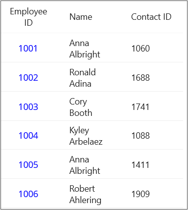

# How to create DataGridTemplate column from code behind in MAUI DataGrid
In.NET [MAUI DataGrid](https://www.syncfusion.com/maui-controls/maui-datagrid) (SfDataGrid) allows you to load custom views in its [DataGridCell](https://help.syncfusion.com/cr/maui/Syncfusion.Maui.DataGrid.DataGridCell.html) using the [DataGridTemplateColumn](https://help.syncfusion.com/cr/maui/Syncfusion.Maui.DataGrid.DataGridTemplateColumn.html). It can be created both in XAML and in the code behind. You can load any view inside the **DataGridCell** by customizing the [CellTemplate](https://help.syncfusion.com/cr/maui/Syncfusion.Maui.DataGrid.DataGridTemplateColumn.html#Syncfusion_Maui_DataGrid_DataGridTemplateColumn_CellTemplate) property of the **DataGridTemplateColumn**.

The below code illustrates how to add **DataGridTemplateColumn** in code-behind.

```C#
public partial class MainPage : ContentPage
{
    private SfDataGrid sfDataGrid;
    private EmployeeViewModel gridData;

    public MainPage()
	{
		InitializeComponent();
        sfDataGrid = new SfDataGrid();
        gridData = new EmployeeViewModel();
        sfDataGrid.AutoGenerateColumnsMode = AutoGenerateColumnsMode.None;
        var templateColumn = new DataGridTemplateColumn()
        {
            MappingName = "EmployeeID",
            HeaderText = "Employee ID",
            Width = 100
        };
        var dataTemplate = new DataTemplate(() =>
        {
            var label = new Label()
            {
                TextColor = Colors.Blue,
                VerticalOptions = LayoutOptions.Center,
                HorizontalOptions = LayoutOptions.Center
            };
            label.SetBinding(Label.TextProperty, "EmployeeID");
            return label;
        });
        templateColumn.CellTemplate = dataTemplate;
        sfDataGrid.Columns.Add(templateColumn);
        sfDataGrid.Columns.Add(new DataGridTextColumn() { MappingName = "Name", Width = 100 });
        sfDataGrid.Columns.Add(new DataGridTextColumn() { MappingName = "ContactID",HeaderText="Contact ID", Width = 100 });
        sfDataGrid.ItemsSource = gridData.Employees;
        this.Content = sfDataGrid;
    }	
}                
```

## Conclusion
I hope you enjoyed learning about how to you to create DataGridTemplate column from code behind in MAUI DataGrid (SfDataGrid).

You can refer to our [.NET MAUI DataGrid’s feature tour](https://www.syncfusion.com/maui-controls/maui-datagrid) page to know about its other groundbreaking feature representations. You can also explore our .NET MAUI DataGrid Documentation to understand how to present and manipulate data.
For current customers, you can check out our .NET MAUI components from the [License and Downloads](https://www.syncfusion.com/account/downloads) page. If you are new to Syncfusion, you can try our 30-day free trial to check out our .NET MAUI DataGrid and other .NET MAUI components.
If you have any queries or require clarifications, please let us know in comments below. You can also contact us through our [support forums](https://www.syncfusion.com/forums), [Direct-Trac](https://support.syncfusion.com/account/login?ReturnUrl=%2Faccount%2Fconnect%2Fauthorize%2Fcallback%3Fclient_id%3Dc54e52f3eb3cde0c3f20474f1bc179ed%26redirect_uri%3Dhttps%253A%252F%252Fsupport.syncfusion.com%252Fagent%252Flogincallback%26response_type%3Dcode%26scope%3Dopenid%2520profile%2520agent.api%2520integration.api%2520offline_access%2520kb.api%26state%3D8db41f98953a4d9ba40407b150ad4cf2%26code_challenge%3DvwHoT64z2h21eP_A9g7JWtr3vp3iPrvSjfh5hN5C7IE%26code_challenge_method%3DS256%26response_mode%3Dquery) or [feedback portal](https://www.syncfusion.com/feedback/maui?control=sfdatagrid). We are always happy to assist you!